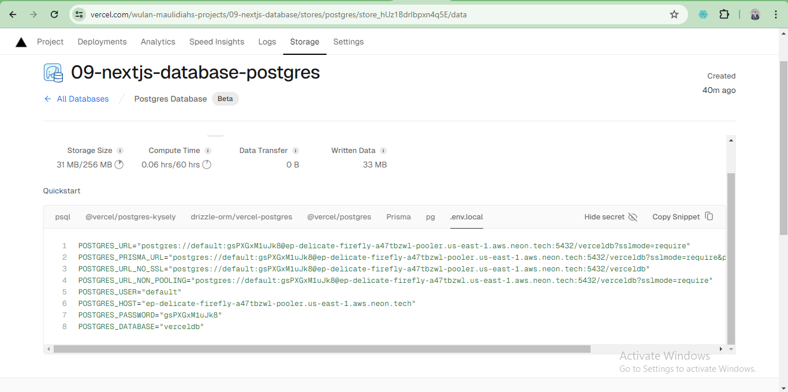

This is a [Next.js](https://nextjs.org/) project bootstrapped with [`create-next-app`](https://github.com/vercel/next.js/tree/canary/packages/create-next-app).

## Getting Started

First, run the development server:

```bash
npm run dev
# or
yarn dev
# or
pnpm dev
# or
bun dev
```

Open [http://localhost:3000](http://localhost:3000) with your browser to see the result.

You can start editing the page by modifying `app/page.tsx`. The page auto-updates as you edit the file.

This project uses [`next/font`](https://nextjs.org/docs/basic-features/font-optimization) to automatically optimize and load Inter, a custom Google Font.

## Learn More

To learn more about Next.js, take a look at the following resources:

- [Next.js Documentation](https://nextjs.org/docs) - learn about Next.js features and API.
- [Learn Next.js](https://nextjs.org/learn) - an interactive Next.js tutorial.

You can check out [the Next.js GitHub repository](https://github.com/vercel/next.js/) - your feedback and contributions are welcome!

## Deploy on Vercel

The easiest way to deploy your Next.js app is to use the [Vercel Platform](https://vercel.com/new?utm_medium=default-template&filter=next.js&utm_source=create-next-app&utm_campaign=create-next-app-readme) from the creators of Next.js.

Check out our [Next.js deployment documentation](https://nextjs.org/docs/deployment) for more details.


## LAPORAN TUGAS WEEK 9
Nama : Wulan Maulidiah
NIM : 2341728038
Kelas : TI - 3A

1. Bukti deploy

Setelah melakukan deploy project menggunakan vercel dapat diketahui bahwa vercel dapat melakukan deploy serverless functions dan database, artinya kita tidak perlu membeli atau mengelola server sendiri. Vercel juga memberikan layanan database yang dikelola sepenuhnya serta platform yang terpadu untuk hosting, deployment, dan database.

2. Disini kita membuat database dengan menggunakan postgres.


3. Setelah database dibuat, selanjutnya kita membuat tabel, yang mana pada file src/seeder/seed.js terdapat instruksi dengan menggunakan query SQL untuk membuat tabel user, invoices, customers, dan revenue. Kemudian instruksi untuk mengisi data dari tabel-tabel tersebut terdapat pada file src/seeder/data.js. Untuk mengeksekusi kedua file tersebut jalankan perintah "npm run seed" pada terminal.


4. Pada query tersebut digunakan untuk menampilkan data kolom customer_id, amount, dan status dari tabel Invoices yang hanya memiliki status pending.


5. Berikut tampilan dashboard 


6. Pada bagian ini kita memanggil komponen chart yang sudah disimpan pada folder atom.


